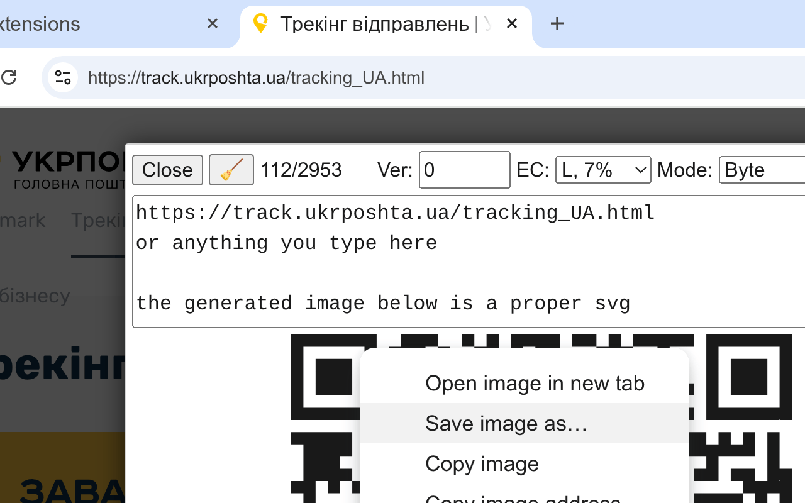

# Offline QR Maker

* [Chrome Web Store](https://chromewebstore.google.com/detail/offline-qr-maker/ialnkjojemdpiilocpkjemabpfplgina)
* [.crx file](http://gromnitsky.users.sourceforge.net/js/chrome/)

A browser extension (manifest v3) for generating QR codes offline from
URLs, text selections or arbitrary user input.

* QR code is an SVG & can be saved to a file;
* a responsive modal dialog;
* uses a canonical `qrcode-generator` lib from [Kazuhiko
  Arase](https://github.com/kazuhikoarase/qrcode-generator/tree/master/js);
* `activeTab` permission, instead of `<all_urls>`.

## Compilation

~~~
$ sudo dnf install jq jsonnet
$ make crx
~~~

The result should be in `_out` dir.

## License

MIT.
